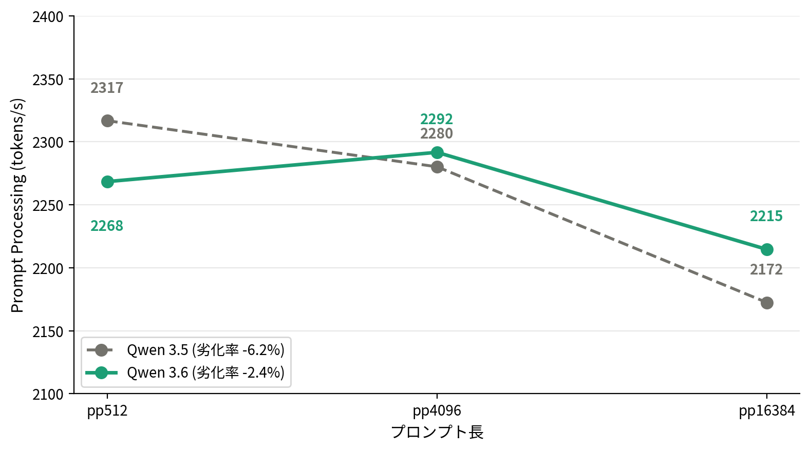
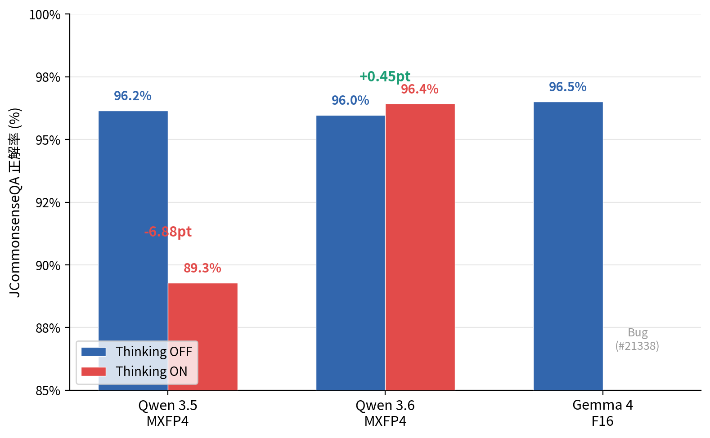

# Gemma 4 vs Qwen 3.5 — MoE Benchmark on DGX Spark with llama.cpp

Benchmark comparison of **Gemma 4 26B-A4B** (F16) and **Qwen 3.5-35B-A3B** (MXFP4) on NVIDIA DGX Spark using llama.cpp, covering Japanese text reasoning, multimodal VLM tasks, and raw inference speed.

This work was inspired by and extends the Ollama-based Gemma 4 benchmark published on [DevelopersIO](https://dev.classmethod.jp/articles/dgx-spark-gemma4-benchmark/) by adding Qwen 3.5 comparison and using llama.cpp as a unified runtime.

## Hardware

| Spec | Value |
|---|---|
| System | NVIDIA DGX Spark |
| GPU | NVIDIA GB10 (Grace Blackwell Superchip) |
| Unified Memory | 128 GB LPDDR5X (~273 GB/s bandwidth) |
| OS | Ubuntu 22.04 (ARM64/SBSA) |
| CUDA | 13.0 (Driver 580.126.09) |
| llama.cpp | b8665 (built from source, CUDA sm_121) |

## Models

| Model | Quantization | GGUF Size | VRAM Usage | Source |
|---|---|---|---|---|
| Gemma 4 26B-A4B-it | F16 | 47.0 GiB | 56,464 MiB | [ggml-org](https://huggingface.co/ggml-org/gemma-4-26B-A4B-it-GGUF) |
| Qwen 3.5-35B-A3B | MXFP4 | 20.1 GiB | 26,432 MiB | [ggml-org](https://huggingface.co/ggml-org/Qwen3.5-35B-A3B-GGUF) |

Both are MoE (Mixture-of-Experts) architectures with 3-4B active parameters, making them well-suited for the bandwidth-limited DGX Spark environment.

## Results Summary

### llama-bench (Raw Inference Speed)

```bash
llama-bench -m <model.gguf> -ngl 999 -fa 1 -p 2048 -n 32 -ub 2048
```

| Model | Size | pp2048 (tok/s) | tg32 (tok/s) |
|---|---|---|---|
| Qwen 3.5-35B-A3B MXFP4 | 20.1 GiB | **2,828** | **58.0** |
| Gemma 4 26B-A4B F16 | 47.0 GiB | 2,273 | 26.5 |

Token generation is bandwidth-bound on DGX Spark's LPDDR5X (~273 GB/s):

```
Qwen 3.5:  273 GB/s ÷ ~3 GB (Active 3B, MXFP4)  ≈ 91 t/s theory → 58 measured (64% efficiency)
Gemma 4:   273 GB/s ÷ ~8 GB (Active 3.8B, F16)   ≈ 34 t/s theory → 26.5 measured (78% efficiency)
```

### JCommonsenseQA (Japanese Common Sense Reasoning)

[JCommonsenseQA v1.1](https://huggingface.co/datasets/leemeng/jcommonsenseqa-v1.1) — 1,119 five-choice questions, 3-shot prompting.

| Model | Quantization | Think | Accuracy | Latency/q | tok/s |
|---|---|---|---|---|---|
| Gemma 4 26B-A4B | F16 | OFF | **96.51%** | 0.376s | 26.7 |
| Qwen 3.5-35B-A3B | MXFP4 | OFF | 96.16% | **0.236s** | ~60 |
| Qwen 3.5-35B-A3B | MXFP4 | ON | 89.28% | 13.71s | 60.2 |
| Gemma 4 26B-A4B | F16 | ON | ❌ Bug (F16-specific, see below) | — | — |

Quality is virtually identical (0.35pt difference). Thinking mode degrades accuracy on knowledge-based tasks for both models.

### VLM Multimodal Benchmark

| Task | Gemma 4 F16 | Qwen 3.5 MXFP4 |
|---|---|---|
| Caption (5 images) | **21.0s** | 23.0s |
| JSON extraction (5 images) | 6.75s | **4.56s** |
| JSON parse rate | **100%** | **100%** |
| PPE detection (3 images) | 11.63s | **8.75s** |
| PPE parse rate | **100%** | **100%** |
| VLM tok/s | 26.0 | 44.2 |

Both models achieve 100% JSON parse rate across all tasks.

## Known Issue: Gemma 4 Thinking Mode Bug (F16 GGUF)

**Affected:** Gemma 4 26B-A4B F16 GGUF (confirmed on llama.cpp b8665 and b8672)
**Tracked:** [ggml-org/llama.cpp Discussion #21338](https://github.com/ggml-org/llama.cpp/discussions/21338)

### Update (2026-04-07)

Further testing revealed the bug is **specific to the F16 GGUF**, not a general llama.cpp regression. A clean b8672 rebuild on the same hardware still reproduces the issue with F16, while Q4_K_M works correctly.

| Model | Quant | Backend | Thinking ON |
|---|---|---|---|
| Gemma 4 26B-A4B | F16 | CUDA (DGX Spark, b8672) | ❌ `<unused49>` flood |
| Gemma 4 26B-A4B | Q4_K_M | CUDA (DGX Spark, b8672) | ✅ Works correctly |
| Gemma 4 26B-A4B | Q4_K_M | Vulkan (Strix Halo gfx1151, b8672) | ✅ Works correctly |

**Workaround:** Use a quantized GGUF (Q4_K_M confirmed working) instead of F16.

Qwen 3.5 Thinking mode works correctly on both CUDA and Vulkan in all quantizations tested.

### Symptoms

When Thinking mode is active (`thinking = 1` in server logs) with the F16 GGUF, Gemma 4 outputs `<unused49>` tokens indefinitely instead of generating reasoning or content:

```
content: "<unused49><unused49><unused49>...(fills entire max_tokens)"
reasoning_content: ""
finish_reason: "length"
```

### Reproduction

```bash
# Build llama.cpp b8665/b8672 with CUDA for GB10
cmake -B build -DGGML_CUDA=ON -DCMAKE_CUDA_ARCHITECTURES=121 -DGGML_CUDA_F16=ON
cmake --build build -j$(nproc) --target llama-server

# Start server with F16 GGUF (reproduces the bug)
./build/bin/llama-server \
  -m gemma-4-26B-A4B-it-f16.gguf \
  --mmproj mmproj-gemma-4-26B-A4B-it-f16.gguf \
  -ngl 999 --jinja \
  --chat-template-kwargs '{"enable_thinking":true}' \
  --port 8080

# Send a request — F16 produces <unused49> flood
curl -s http://localhost:8080/v1/chat/completions \
  -H "Content-Type: application/json" \
  -d '{
    "model": "gemma4",
    "messages": [{"role": "user", "content": "What is 2+2?"}],
    "max_tokens": 256
  }'

# Same command with Q4_K_M GGUF works correctly
```

### What We Tried (All Failed to Disable Thinking with F16)

| Setting | Result |
|---|---|
| `--chat-template-kwargs '{"enable_thinking":false}'` | Server log still shows `thinking = 1` |
| `--reasoning-budget 0` | No effect, `thinking = 1` |
| `--reasoning-format none` | No effect |
| `--chat-template gemma` (non-Jinja) | `thinking = 0` but multimodal API breaks (tokenization fails) |

### Workaround (Thinking OFF with F16)

For **text-only** inference with Thinking OFF, using `--chat-template-kwargs '{"enable_thinking":false}'` does work at the output level — despite the server log showing `thinking = 1`, the actual generated content does not contain thinking tokens. We used this setting for JCQ benchmarks (96.51% accuracy).

For **multimodal** (VLM) inference, the same workaround applies — `--jinja` with `enable_thinking: false` produces correct image captions and JSON output.

**Only explicit Thinking ON with F16 is broken** — quantized GGUFs do not exhibit this issue.

### Environment Details

```
llama-server --version
version: 8665 (b8635075f) / 8672 (25eec6f32)
built with GNU 13.3.0 for Linux aarch64

GPU: NVIDIA GB10, compute capability 12.1, 122570 MiB
CUDA 13.0, Driver 580.126.09
```

**Note:** Ollama 0.20.0 handles Gemma 4 Thinking mode correctly on the same hardware with the same F16 model, suggesting this is a llama.cpp-specific issue in the F16 code path rather than a model problem.

## Build Instructions (DGX Spark)

```bash
git clone https://github.com/ggml-org/llama.cpp
cd llama.cpp

cmake -B build \
  -DGGML_CUDA=ON \
  -DCMAKE_CUDA_ARCHITECTURES=121 \
  -DGGML_CUDA_F16=ON \
  -DGGML_NATIVE=ON \
  -DCMAKE_BUILD_TYPE=Release

cmake --build build --config Release -j$(nproc) \
  --target llama-server llama-cli llama-bench llama-mtmd-cli
```

## Running Benchmarks

### JCommonsenseQA

```bash
# Start server
./build/bin/llama-server \
  -m <model.gguf> \
  -ngl 999 --jinja \
  --chat-template-kwargs '{"enable_thinking":false}' \
  --port 8080 --temp 1.0 --top-p 0.95 --top-k 64

# Run benchmark (requires: pip install datasets httpx)
python3 jcq_bench.py \
  --model <model-name> \
  --output results/<model-name>.json
```

### VLM Multimodal

```bash
# Start server with mmproj
./build/bin/llama-server \
  -m <model.gguf> \
  --mmproj <mmproj.gguf> \
  -ngl 999 --jinja \
  --chat-template-kwargs '{"enable_thinking":false}' \
  --port 8080

# Run benchmark
python3 vlm_bench.py \
  --model <model-name> \
  --image-dir ~/vlm-test-images \
  --output results/<model-name>_vlm.json
```

## Scripts

| File | Description |
|---|---|
| `jcq_bench.py` | JCommonsenseQA benchmark via OpenAI-compatible API |
| `vlm_bench.py` | VLM multimodal benchmark (caption, JSON extraction, PPE detection) |
| `results/` | Raw benchmark result JSONs |

## References

- [Gemma 4 DGX Spark Benchmark (DevelopersIO, Ollama)](https://dev.classmethod.jp/articles/dgx-spark-gemma4-benchmark/) — Original benchmark article (Japanese)
- [NVIDIA Forum: Gemma 4 Day-1 Benchmarks (vLLM)](https://forums.developer.nvidia.com/t/gemma-4-day-1-inference-on-nvidia-dgx-spark-preliminary-benchmarks/365503)
- [NVIDIA DGX Spark llama.cpp Playbook](https://build.nvidia.com/spark/llama-cpp/overview)
- [llama.cpp Gemma 4 Thinking Bug — Discussion #21338](https://github.com/ggml-org/llama.cpp/discussions/21338)
- [Google Blog: Gemma 4](https://blog.google/innovation-and-ai/technology/developers-tools/gemma-4/)
- [JCommonsenseQA v1.1](https://huggingface.co/datasets/leemeng/jcommonsenseqa-v1.1)

## Blog Posts

- [Qiita (Japanese)](https://qiita.com/nabe2030/items/fc3db819470edcca5aee) — Detailed analysis article

## License

Scripts: MIT License
Benchmark data: See individual dataset licenses.
## Qwen 3.6 vs 3.5 — DGX Spark Benchmark (2026-04-18)

Three findings from running Qwen 3.6-35B-A3B against 3.5 on DGX Spark with llama.cpp b8672 and MXFP4_MOE quantization (21 GiB each).

### Finding 1: Inference speed is identical (±0.5%)

| Metric | Qwen 3.5 | Qwen 3.6 | Delta |
|--------|----------|----------|-------|
| pp512 (t/s) | 2,299.73 | 2,304.22 | +0.2% |
| tg128 (t/s) | 63.17 | 62.91 | -0.4% |

No regression. Drop-in replacement.

### Finding 2: Long-context prompt processing degradation improved 2.6×

| Prompt length | Qwen 3.5 (t/s) | Qwen 3.6 (t/s) |
|---------------|----------------|----------------|
| pp512 | 2,316.82 | 2,268.44 |
| pp4096 | 2,280.22 | 2,291.70 |
| pp16384 | 2,172.44 | 2,214.62 |
| **Degradation (512→16K)** | **-6.2%** | **-2.4%** |



### Finding 3: Thinking mode quality regression is fully resolved

| Model | Thinking OFF | Thinking ON | Delta |
|-------|-------------|-------------|-------|
| Qwen 3.5 MXFP4 | 96.16% | 89.28% | **-6.88pt** |
| Qwen 3.6 MXFP4 | 95.98% | 96.43% | **+0.45pt** |
| Gemma 4 F16 (ref) | 96.51% | ❌ Bug | — |

Qwen 3.5 lost 6.88 points when Thinking was enabled. Qwen 3.6 **gains** 0.45 points — the regression is completely gone.



Benchmark: [JCommonsenseQA v1.1](https://huggingface.co/datasets/leemeng/jcommonsenseqa-v1.1) (1,119 questions, 5-choice, 3-shot).

### Full JCQ results (all models)

| Model | Quant | Thinking | JCQ Accuracy |
|-------|-------|----------|--------------|
| Gemma 4 26B-A4B | F16 | OFF | **96.51%** |
| **Qwen 3.6** | **MXFP4** | **ON** | **96.43%** |
| Qwen 3.5 | MXFP4 | OFF | 96.16% |
| Qwen 3.6 | MXFP4 | OFF | 95.98% |
| Gemma 4 26B-A4B | Q4_K_M | ON | 95.80% |
| Qwen 3.5 | MXFP4 | ON | 89.28% |
| Gemma 4 26B-A4B | F16 | ON | ❌ Bug ([#21338](https://github.com/ggml-org/llama.cpp/discussions/21338)) |

### VLM multimodal

| Task | Qwen 3.5 | Qwen 3.6 | Gemma 4 F16 (ref) |
|------|----------|----------|-------------------|
| Caption avg latency | 17.05s | 15.82s | 41.68s |
| JSON extract latency | 3.82s | 3.92s | 41.31s |
| JSON parse rate | 100% | 100% | 0% |
| PPE detect latency | 5.34s | 5.07s | — |
| PPE parse rate | 100% | 100% | — |
| tok/s | ~61.4 | ~61.6 | 25.7 |

Note: [Segfault reported](https://huggingface.co/unsloth/Qwen3.6-35B-A3B-GGUF/discussions/1) for Qwen 3.6 VLM on llama.cpp, but did not reproduce on DGX Spark (b8672, mmproj-F16).

### Environment

- **Hardware**: NVIDIA DGX Spark (Grace Blackwell GB10, 128 GB unified memory)
- **Runtime**: llama.cpp b8672 (source build, CUDA, `-DCMAKE_CUDA_ARCHITECTURES=121`)
- **Qwen models**: MXFP4_MOE (21 GiB each)
- **Gemma 4**: F16 (51 GiB) / Q4_K_M (15.6 GiB)

### Result files

| File | Description |
|------|-------------|
| `results/jcq_qwen36_mxfp4_nothink.json` | Qwen 3.6 JCQ Thinking OFF |
| `results/jcq_qwen36_mxfp4_think.json` | Qwen 3.6 JCQ Thinking ON |
| `results/jcq_qwen35_mxfp4_nothink.json` | Qwen 3.5 JCQ Thinking OFF |
| `results/vlm_qwen36.json` | Qwen 3.6 VLM benchmark |
| `results/vlm_qwen35.json` | Qwen 3.5 VLM benchmark |

### Blog post (Japanese)

- [Qiita: DGX Spark で Qwen 3.6 vs 3.5 実測比較](https://qiita.com/nabe2030/items/f61bc3627bb92a0388e5) ← URL to be updated after posting
